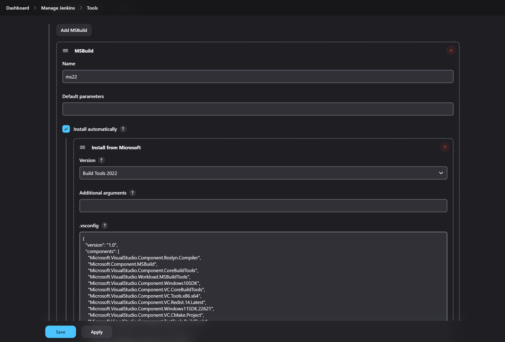

# MSBuild plugin

[](https://ci.jenkins.io/job/Plugins/job/msbuild-plugin/job/master/)
[](https://plugins.jenkins.io/msbuild)
[](https://plugins.jenkins.io/msbuild)
[](https://opensource.org/licenses/MIT)

This plugin allows you to use MSBuild to build .NET and Visual Studio
projects.


## Usage

To use this plugin, specify the location directory of MSBuild.exe on
Jenkin's configuration page. The MSBuild executable is usually
situated in a subfolder of `C:\\WINDOWS\\Microsoft.NET\\Framework`. The
Visual Studio Build Tools 2022 of "msbuild.exe" is located in
`"C:\\Program Files (x86)\\Microsoft Visual Studio\\2022\\BuildTools\\MSBuild\\Current\\Bin\\"` If you have multiple
MSBuild versions installed, you can configure multiple executables. 



Then, on your project configuration page, specify the name of the build
file (`.proj` or `.sln`) and any [command line
arguments](https://docs.microsoft.com/en-us/visualstudio/msbuild/msbuild-command-line-reference?view=vs-2017)
you want to pass in. The files are compiled to the directory where
Visual Studio would put them as well.


Here's an example Jenkins pipeline script for utilizing the MSBuild plugin:
```groovy
pipeline {
    agent any
    tools {
        msbuild 'MSBuild 2022'
    }
    stages {
        stage('Build') {
            steps {
                script {
                    bat 'msbuild right-first-time.sln /p:Configuration=Release %MSBUILD_ARGS%'
                }
            }
        }
    }
}
```

### Troubleshooting

-   When using Command Line Arguments, bear in mind that special
    characters are treated like in Unix, so they will need to be escaped
    using the backslash.
